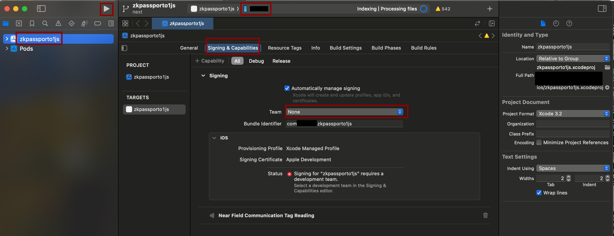

# zk-passport-o1js

# Branches
* Main: Latest stable version. If you're testing, test from this branch.
* Next: Latest code but unstable, might not build/compile even.
* Poc-xxx: Stable proof of concept version

## Changelog
* poc-0.1.0: Added Android support.
* poc-0.0.4: Made iOS working proof-of-concept for nfc read and webview proof gen.

# Required Environment
* Node >= 18
* MacOS and XCode installed (for iOS development builds.)
* Android Studio and SDK installed (for Android development builds)

# Initialize Repo
Repo contains git submodules. So initialize it with: `git submodule update --init --recursive`

# Install Dependencies
Install dependencies via `yarn install` or `npm install`

# Prepare MasterList
The app requires a `masterList.pem` prepared and put in `assets/masterList.pem`
Either download and put it there or generate it. It contains trusted root certificates for all issued passports. `withCSCAMasterList.js` plugin will automatically bundle it along with iOS and Android assets.

## How to Generate MasterList
Exact details can be found in [NFCPassportReader](https://github.com/corupta/NFCPassportReader/tree/main/scripts) but the critical issue is ICAO (distributer) doesn't want this process to be automated.
* Make sure you have python3 installed.
* Go to [https://download.pkd.icao.int](https://download.pkd.icao.int) and download latest *CSCA Master Lists*
    * The downloaded file should have a name similar to `icaopkd-002-complete-000284.ldif` in which 284 designates the version number. (Always download the latest one)
    * Make sure the file is around 8-9MB in size, and contains `complete` in the name and not `delta`
* Then run `npm run generateCSCAMasterList path/to/yourdownloaded.ldif` to generate `masterList.pem` in your current directory
* Move the generated `masterList.pem` to `assets/masterList.pem`

# How to Run

## Create a development build for iOS
* Run `npm run ios` to create a development build and start expo server.
    * This process creates an `ios` folder with an XCode workspace if it's not there already.
    * We decided to put ios and android folders into .gitignore and instead only apply modifications via expo plugins. That way, it is much more easier to maintain them.
* If you have an open iOS Simulator, it will automatically install and start app in it.
* Note that since, iOS Simulator doesn't have NFC Reading capability, you might want to test with a real iPhone. However, doing so requires an Apple developer account.
    1. Make sure the build finished and it was at the stage where it opened iOS simulator
    2. Open `ios/zkpassporto1js.xcworkspace` with XCode. (Make sure to open workspace and not project)
    3. Choose `zkpassporto1js` Project from the left pane.
    4. Open `Signing & Capabilities` tab.
    5. Select a team. (Personal teams are NOT accepted for NFC capability)
    6. From the top, choose your iOS device. (Make sure to enable developer mode on your phone and connect it to your Mac via cable.)
    7. Press the run button. (It will build and install the app on your device. If it opens expo screen in mobile but won't start the app, make sure your iPhone is in the same network as your mac)

## Create a development build for Android
* Run `npm run android` to create a development build and start expo server.
    * This process creates an `android` folder with gradle etc. build scripts if it's not there already.
    * We decided to put ios and android folders into .gitignore and instead only apply modifications via expo plugins. That way, it is much more easier to maintain them.
* When the build is finished, if you have an open Android simulator, it will automatically install and start app in it.
* Note that since, Android simulator doesn't have NFC Reading capability, you might want to test with a real Android. 
    * Enable Developer mode and ADB USB debugging in your mobile phone.
    * Connect it to your computer and make sure your device is listed when run `adb list`.
    * Re-run `npm run android` or press `a` in expo server.
    * It should build and install the app on your phone.

## FAQ
* I installed a development build for my device, it opens but gives an error with failed to connect... Make sure your mobile device and computer running expo server (Started via `npm start`) is on the same network, and try again.

# How to Use the App (DEMO)
In the current stage, there are only demo tabs.
The second tab creates a dummy o1js proof in a webview.
The third tab is the actual demo page.
* You should enter passport number, date of birth, passport expiry date and click generate MRZ. (MRZ Scanning is being developed as of now) 
* Now you should be able to press scan button. Press and scan your passport. (On Android a NFC reading bottom sheet in UI is being implemented, for now it scans in background)
* You should see your passport data in both raw form and openpassport json format.
* You can click copy button to copy all data in clipboard (to export)
* The final according part is to test messaging with a webview. (Currently there's a webview for generating proof, and send to webview button sends the data to that webview as json. In our testing the webview usually crashed due to memory overflow, as our tested zkProgram was a big one. In the future we can create smaller zkPrograms and generate many mini-proofs, which can be verified&combined in a computer)

# TODO
- [x] Write Readme
- [x] Document how to re-create `masterList.pem` in the future for certificate validation.
    - [x] Tested `masterList.pem` extracted from `icaopkd-002-complete-000284.ldif`
        Change folder to project root. Run `yarn generateCSCAMasterList /path/to/icaopkd-002-complete-000284.ldif` to generate.
- [ ] Check/Ask Permissions for NFC/Camera if not permitted yet.
- [ ] Implement NFC Scanner
    - [x] Implement for IOS
    - [x] Implement for Android
    - [ ] Allow active authentication?
- [ ] Implement MRZ Scanner
    - [ ] Implement for IOS
    - [ ] Implement for Android
- [ ] Implement SDK Communication
    - [ ] Create a node.js process
    - [ ] Announce bonjour service
    - [ ] Start a socket io server
- [ ] Implement Async Storage
- [ ] Implement Encrypted Storage
- [ ] Implement UI
    - [ ] Implement Passport Info Page
        - [ ] Implement Scan MRZ Page
        - [ ] Implement Scan NFC Page
        - [ ] Implement Password Lock Page
        - [ ] Implement Unlock Password Page
        - [ ] Implement log secure (dont log on production but only in dev mode) for passport data etc.
    - [ ] Implement Proof Generation Page
    - [ ] Implement Previous Proofs Page
        - [ ] Implement filterable/sortable page view (requested, proved, etc. and date)
        - [ ] Useful to share chain view link if available (SDK might provide metadata about where the proof was used)
        - [ ] Proof details popup/page
    - [ ] Implement Help Button
    - [ ] Implement Tutorial Carousel
- [ ] Implement deep linking

# Random TODO
- [ ] Remove all moment and replace them with luxon/dayjs/date-fns
- [ ] Add timezone support.

# Notes
Heavily inspired by [zk-passport/openpassport](https://github.com/zk-passport/openpassport) project.

# Used Toolchains

#### expo
Main react native modules, package, bundle manager, etc.

For now ios and android folder is not sent to git.
Instead they are generated via expo `npx expo prebuild --clean` and those files are modified programmatically via expo plugins and mods.

#### react-native-paper
Material 3 (Material for you) based UI Library.

#### twrnc
Allows easily adding tailwind style classes to components.

#### react-native-nfc-manager
Check if device has nfc capabilities

#### react-native-passport-reader
Passport reader for android only

#### NFCPassportReader
Passport reader for ios (native module)
* We inspected PassportReader.swift wrapper from OpenPassport along with the native passport reader module.
* Important note is that the new version of NFCPassportReader started using secure logs, but OpenPassport logs them in the console along with some direct prints in the wrapper, might be exposing them to device system log.
* We use a forked version of NFCPassportReader including changes from OpenPassport team to expose some data as public.
* Note to self: Take special care not to log these data in production, and always save in secure context.

#### nodejs-mobile-react-native
Used to spawn a node process to create a server on local network

#### @homebridge/ciao
Used to announce server via bonjour service

#### socket.io server
Used for communication via browsers in local network.